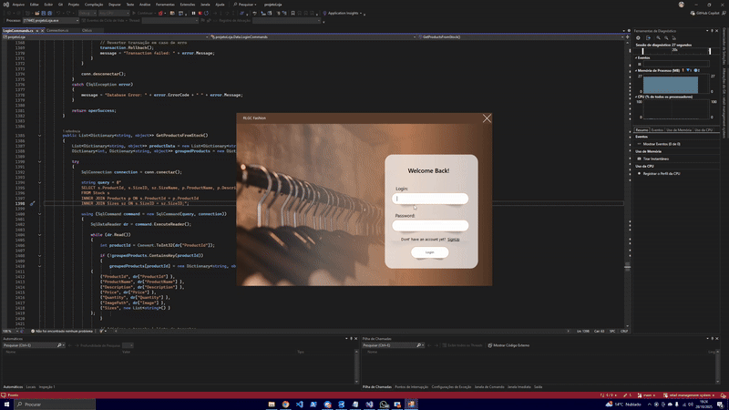

# 🏬 Retail Management System


---

## 🏷️ Badges


---

## 📝 Short Description

**Retail Management System** is a Windows Forms application developed as an **academic project** that simulates the main functionalities of a real retail store management system.

It focuses on **inventory control, employee and client management, sales processing, and administrative operations**, implementing **CRUD functionalities** (Create, Read, Update, Delete) throughout its interface.

The system was designed with different user roles (**Admin, Manager, Employee, and Client**), each having distinct permissions and access levels - closely reflecting a real-world retail environment.

🧠 **Highlight:**  
This project was built to strengthen knowledge in **C# programming, SQL Server database integration, layered architecture**, and **realistic retail system simulation**.
<br><br>
> 🗒️ **Note:**  
> All code comments and database documentation inside `baseDadosLoja.txt` are written in **Portuguese**,  
> as this project was developed for academic purposes in Portugal.

---

## 🎞️ GIFs / Screenshots

**<h3>1️⃣ Login, Validation & Client Purchase Flow</h3>**
<p align="left">
  
</p>
<i>Shows login and registration with validation, followed by a client browsing products, using filters, adding items to the cart, and completing a purchase.</i>
<br></br>

**<h3>2️⃣ Product CRUD (Admin Operations)</h3>**
<p align="left">
  
</p>
<i>Demonstrates the admin registering a new product, consulting the list, updating details, deleting items, and testing validation rules.</i>
<br></br>

**<h3>3️⃣ Admin Permissions Overview</h3>**
<p align="left">
  
</p>
<i>Displays all admin privileges, including access to registration and consultation modules, employee and product updates, search functionality, and general CRUD interactions.</i>

---

## 💻 Technologies

- **C#**
- **.NET Framework 4.7.2**
- **Windows Forms (GUI)**
- **SQL Server (Database)**
- **Visual Studio 2022**

---

## ⚙️ Installation & Usage

### Clone the Repository
```bash
git clone https://github.com/goncalo-codes/retail-management-system.git
```
### Open & Run

```bash
1. Open 'projetoLoja.sln' in Visual Studio 2022
2. Make sure .NET Framework 4.7.2 is installed
3. Do the Database Setup steps (see **Database Setup** section below)
4. Build the solution (Build → Build Solution)
5. Run the app (Start ▶)
```

## 🔹 Database Setup (SQL Server)

This project uses **SQL Server** as the database engine.  
All tables, relationships, and seed data are provided in the following file:

📄 **`baseDadosLoja.txt`**

<br>

### 🧭 Setup Steps:

1. Open **SQL Server Management Studio (SSMS)**  
2. Open or copy the content of the file **`baseDadosLoja.txt`**
3. Execute the script (press **F5**) — it will automatically create the database **`lojaDB`**
4. The script includes:
   - Tables for `Users`, `Clients`, `Employees`, `Categories`, `Products`, `Stock`, `Sales`, and `Sizes`
   - Example data and predefined relationships  
   - Clear comments describing each section and table purpose

<br>
  
> ⚠️ **Important:** Before running the app, open `src/Data/Connection.cs` and update the connection string in the `Connection()` constructor to match your SQL Server setup:
>
> ```csharp
> conn.ConnectionString = "Data Source=localhost;Initial Catalog=lojaDB;Integrated Security=True;TrustServerCertificate=True;";
> ```
> Modify `Data Source`, `Initial Catalog`, or authentication (User ID/Password) if your SQL Server is on another machine, container, or uses SQL login.

---

## 🖼️ Optional Product Images

- The system supports **optional product images** stored as **BLOBs** in the database.  
- Some sample images are already included in the folder `src/Resources/`.
- They are **not linked to the database by default** (`Image` column remains `NULL`).

<br>

### ❓ How to Add Images to the Database

1. Navigate to your local directory, for example:  
   `C:\YourPath\src\Resources\`
2. Add your image files to this folder.  
3. Use one of the SQL examples below to **insert or update images** in your database.

---

### 💾 Example Commands

```sql
-- Insert a new product with an image
INSERT INTO Products (ProductName, Description, Price, Image, CategoryID)
VALUES (
    'Blue T-Shirt',
    'High-quality cotton blue T-shirt',
    15.99,
    (SELECT * FROM OPENROWSET(BULK 'C:\YourPath\Resources\blueTshirt.png', SINGLE_BLOB) AS ImageData),
    1
);

-- Update an existing product image
UPDATE Products
SET Image = (
    SELECT * FROM OPENROWSET(BULK 'C:\YourPath\Resources\blueTshirt.png', SINGLE_BLOB) AS ImageData
)
WHERE ProductID = 1;
```

<br>

---

## 🧩 System Overview

The application simulates a **real retail management environment**,  
including four different user roles and multiple **CRUD-based modules**.

<br>

### 👤 User Roles and Permissions

| **Role** | **Can Register** | **Can Consult** | **Can Update** | **Can Delete** |
|-----------|------------------|-----------------|----------------|----------------|
| **Admin** | Clients, Employees, Products, Sales | All tables | All entities | ✅ |
| **Manager** | Clients, Products, Sales | All except Employees | All, except Employees | ✅ |
| **Employee** | Clients, Sales | Clients, Sales, Stock | Clients, Sales | ❌ |
| **Client** | N/A | Products, Cart | N/A | N/A |

<br>

### 🧠 CRUD Functionality Breakdown

The system is structured around **Create, Read, Update, Delete** operations,  
implemented throughout the `Presentation` layer.

#### 📁 Folder Overview

| **Folder** | **Purpose** | **Example Forms** |
|-------------|-------------|-------------------|
| `REGISTER/` | Create new records *(Insert)* | `frmRegisterSale`, `frmRegisterClient`, `frmRegisterProduct`, `frmRegisterEmployee`, `frmRegisterStock` |
| `CONSULT/`  | Read existing data *(View/Search/Delete)* | `frmConsultSale`, `frmConsultClient`, etc. |
| `UPDATE/`   | Update existing records *(Edit)* | `frmUpdateProduct`, `frmUpdateStock`, etc. |

**Additional standalone forms:**  
`frmLogin`, `frmCart`, `frmAdmin`, `frmManager`, `frmEmployee`, `frmClient`, `frmStock`

<br>

---

### 🗂️ Project Structure (Summary)

```text
retail-management-system/
│
├─ src/                     # Main application code
│   ├─ Control/
│   ├─ Data/
│   ├─ Presentation/
│   │   ├─ REGISTER/        # Insert clients, employees, products, sales
│   │   ├─ UPDATE/          # Edit existing records
│   │   └─ CONSULT/         # View, delete, or update records
│   ├─ Properties/
│   ├─ Resources/           # Internal images (e.g., products)
│   ├─ App.config
│   ├─ Program.cs
│   └─ projetoLoja.csproj
│
├─ assets/                  # GIFs and banner for README
│   ├─ login.gif
│   ├─ admin-panel.gif
│   └─ cart.gif
│
├─ baseDadosLoja.txt        # Database script and setup instructions
├─ projetoLoja.sln          # Visual Studio solution
├─ LICENSE                  # MIT License
└─ README.md                # This file
```
--- 

### 💡 Project Highlights

- Implemented **layered architecture** (`Data`, `Control`, `Presentation`)
- Built a fully functional **CRUD system**
- Simulated **real retail workflows** with user permissions
- Integrated **SQL Server backend** with realistic dataset
- Supported **BLOB image storage**
- Developed as an **academic project** to explore structured programming and database design

---

## 👨‍🏭 My Contributions

- I **led the architectural design and developed the main logic of the system**, structuring it into layered modules (`Data`, `Control`, `Presentation`).  
- I **built most of the Windows Forms interface**, **implemented CRUD operations** for all entities, and created the user permission logic.  
- I also worked on **error handling** and **business validations**.

This **`README.md` and repository organization** were fully created by me as a professional showcase of the project.
